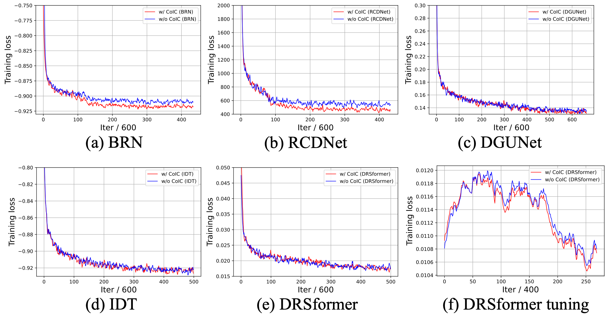

## Contents

>- [A real-world deraining demo](#a-real-world-deraining-demo)
>- [More real-world deraining comparison](#more-real-world-deraining-comparison)
>
>- [Training histories of all models](#training-histories-of-all-models)

---

### A real-world deraining demo

We tune DRSformer trained w/o and w/ CoIC on a pseudo real-world dataset SPAData for another 105k iters. Surprisingly, we observe that DRSformer w/ CoIC tuned on SPAData can efficiently deraining challenging images contaminated with intricate rains. Below are a demon comparison. This indicates that the proposed CoIC can help train powerful deraining models using *both synthetic and real-world datasets*.

  *The Left: * ***DRSformer w/o CoIC tuned on SPAData**                               *The Right: *  ***DRSformer w/ CoIC tuned on SPAData***

We also find that after tuned on SPAData, DRSformer w/o CoIC cannot well handle both synthetic and real-world rain. However, with the help of the CoIC, DRSformer can achieve much better performances. Below are quantitative results (PSNR only, full results can be seen in our revised paper):

| Methods            | Rain200L  | Rain200H  | Rain800   | Rain1200  | Rain1400  | SPAData   |
| ------------------ | --------- | --------- | --------- | --------- | --------- | --------- |
| DRSformer w/o CoIC | 39.32     | 29.27     | 28.85     | 34.91     |           |           |
| DRSformer w/ CoIC  | **39.70** | **30.31** | **29.73** | **35.02** | **33.94** | **46.03** |

The results tabulated above demonstrate that **a pre-trained DRSformer model can simultaneously perform well on five synthetic datasets, as well as the pesudo real-world SPAData, with the help of the proposed CoIC strategy**. *In the future, we will step further to learn a unifed image deraining model for more practical utilization*. 

----

### More real-world deraining comparison

We provide more high-quality real-world deraining results to demonstrate the effectiveness of the proposed CoIC, while enables DRSformer to learn from both mixed synthetic datasets and real-world SPAData datasets.

----

### Training histories of all models

Below we show the training loss curves of BRN, RCDNet, DGUNet, IDT, and DRSformer trained on mixed synthetic datasets. Additionally, training loss curves of DRSformer tuned on SPAData are also included.

